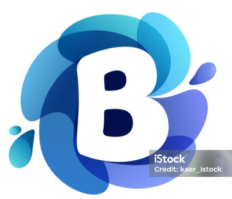
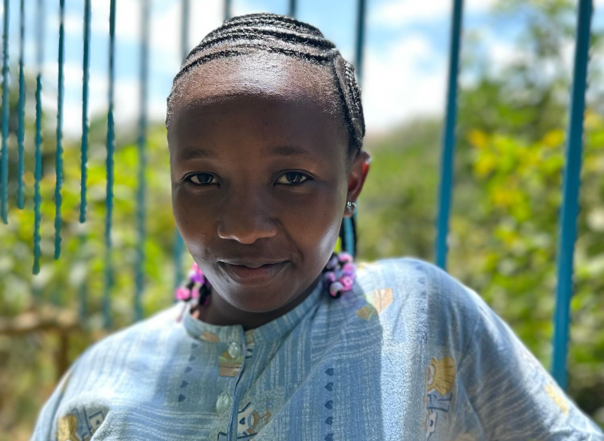
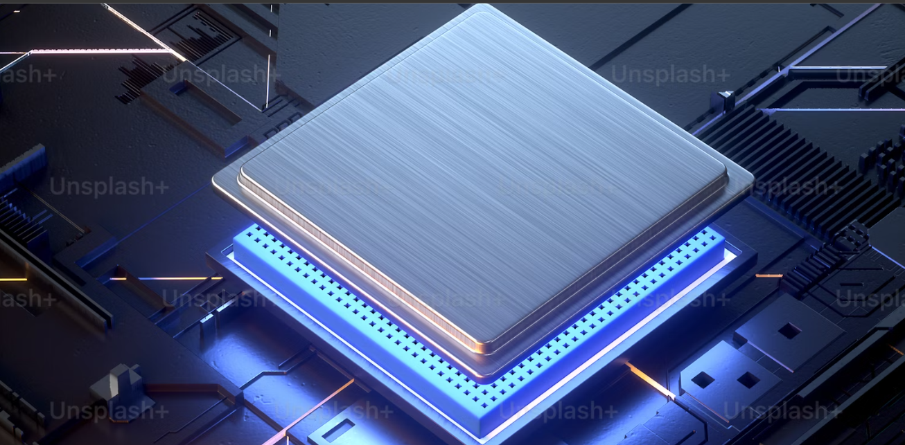
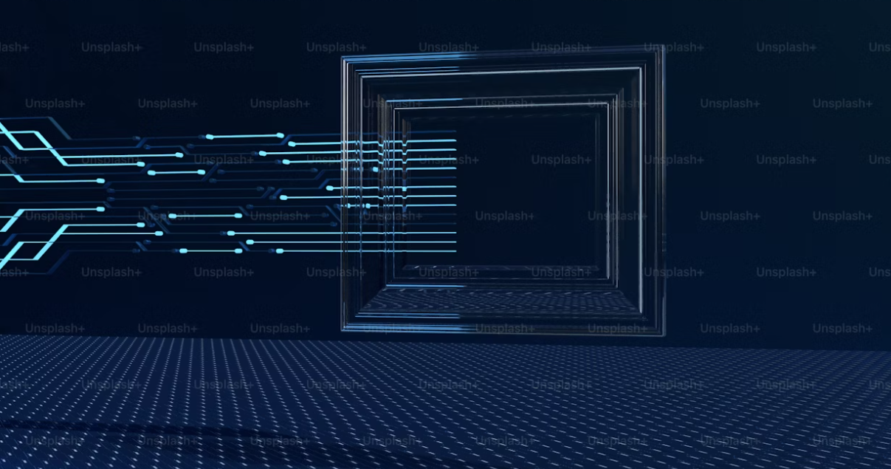

<html lang="en">
<head>
    <meta charset="UTF-8">
    <meta name="viewport" content="width=device-width, initial-scale=1.0">
    <title>My Portfolio</title>
    <link rel="stylesheet" href="https://stackpath.bootstrapcdn.com/bootstrap/4.5.2/css/bootstrap.min.css">
    <link rel="stylesheet" href="styles.css">
    
</head>
<body>

    <!-- Navigation Section -->
    <nav class="navbar navbar-expand-lg navbar-dark bg-dark">
        

            <a class="navbar-brand" href="#">
                My Portfolio</a>
            <button class="navbar-toggler" type="button" data-toggle="collapse" data-target="#navbarNav" aria-controls="navbarNav" aria-expanded="false" aria-label="Toggle navigation">
                
            </button>
            

                <ul class="navbar-nav ml-auto">
                    <li class="nav-item"><a class="nav-link" href="#about">About</a></li>
                    <li class="nav-item"><a class="nav-link" href="#projects">Projects</a></li>
                    <li class="nav-item"><a class="nav-link" href="#contact">Contact</a></li>
                </ul>
            

        

    </nav>
    <!-- End Navigation Section -->

    <!-- Header Section -->
    <header class="jumbotron text-center" style="background-image: url('images/header2.PNG'); height: 300px; background-size: cover; opacity: 7; background-position: center; color: cyan;">
        

            <h1 class="display-4">Hello, welcome to my portfolio</h1>
            
I'm thrilled to have you here. Explore my journey in design, development, and creativity.

            
I help businesses and individuals bring their ideas to life.

            
Code it. Build it. Scale it. Master the stack.

            <a href="#projects" class="btn btn-primary btn-lg">View my Work</a>
        

    </header>
<!-- Header Section -->

<!-- About Section  start-->
    <section id="about" class="py-5">
        

            

                

                    <h2>Who am I ?</h2>
                    

                        Hi, I’m Bridget Wachira, a versatile Full Stack Developer passionate about building end-to-end solutions that are both functional and visually appealing. With expertise in frontend and backend technologies, I specialize in creating seamless user experiences powered by robust and scalable systems.

                        I thrive on solving complex problems and turning ideas into innovative applications. My skill set includes HTML, CSS, JavaScript, and frameworks like Bootstrap for designing intuitive interfaces, alongside backend tools and databases for managing dynamic content and efficient data handling.

                        I’m committed to continuous learning and exploring new technologies, including cloud computing and DevOps, to deliver modern, future-ready applications. Whether it's developing a web app, optimizing a system, or designing a captivating user interface, I’m here to bring visions to life.

                        Let’s build something extraordinary together!
                    

                

                

                    
                

            

        

    </section>
<!--about section end-->
<!--project section-->
<section id="projects" class="py-5">
    

        <h2>Featured Projects</h2>
     

         

             

                 
                 

                     <h5 class="card-title">Project 1: Web App</h5>
                     
A dynamic web application built using HTML, CSS, and JavaScript.

                     <a href="project1.html" class="btn btn-light">View Details</a>
                 

             

         

         

             

                 
                 

                     <h5 class="card-title">Project 2: Mobile App</h5>
                     
A mobile app designed for seamless user experiences with React Native.

                     <a href="project2.html" class="btn btn-light">View Details</a>
                 

             

         

         

             

                 
                 

                     <h5 class="card-title">Project 3: E-commerce Site</h5>
                     
An e-commerce website built with Django and integrated payment systems.

                     <a href="project3.html" class="btn btn-light">View Details</a>
                 

             

         

 
     

 

 </section>
 <!--    project section end-->

<!-- Contact Section -->
<section id="contact" class="py-5 p-5">
       

            <h2>Contact Me</h2>
            
If you'd like to get in touch, feel free to reach out via email or through social media:

           <ul class="list-unstyled d-flex justify-content-center flex-column align-items-center">
                <li><strong>Email:</strong> <a href="mailto:wanjirubridget10@gmail.com">wanjirubridget10@gmail.com</a></li>

                <li><strong>Phone:</strong> <a href="tel:+254741791091">+254741791091</a></li>

                <li><strong>LinkedIn:</strong> <a href="https://www.linkedin.com/in/bridget-wachira-48b928265/" target="_blank">linkedin.com/in/yourprofile</a></li>
                <li><strong>GitHub:</strong> <a href="https://github.com/wachirabridget/" target="_blank">github.com/wachirabridget</a></li>
            </ul>

            <h4>Contact via WhatsApp:</h4>
            <a href="https://wa.me/+254741791091" target="_blank" class="btn btn-info mb-4">Chat with me on WhatsApp</a>

            <h4>Download My Resume</h4>
            <a href="BRIDGET_WANJIRU (2).docx" class="btn btn-info" download>Download Resume (PDF)</a>
        

</section>
<!--    contact section end-->

    <!-- Footer Section -->
<footer class="bg-dark text-white text-center py-4"  >
        

            
&copy; 2024 My Portfolio.bridget.

            
Follow me on:
            <a href="https://www.linkedin.com/in/bridget-wachira-48b928265/" class="text-white ml-2">LinkedIn</a> |
            <a href="https://github.com/wachirabridget/" class="text-white ml-2">GitHub</a>
            

                <a href="term.html">Terms of Service</a> |
                <a href="privacy.html">Privacy Policy</a> |
                <a href="#top" class="btn btn-link">Back to Top</a>
            

        

</footer>
    
    
    
</body>
</html>
## Overview

Welcome to my portfolio! This website showcases my skills, projects, and expertise as a Full Stack Developer. It features a user-friendly design, interactive elements, and a responsive layout to highlight my journey in web and mobile development.

## Features

- **Modern UI/UX**: A visually appealing interface with smooth animations and a structured layout.
- **Responsive Design**: Fully optimized for desktops, tablets, and mobile devices.
- **Projects Showcase**: Highlights key projects with images, descriptions, and links for more details.
- **Contact Section**: Provides multiple ways to connect with me, including email, phone, WhatsApp, and LinkedIn.
- **Resume Download**: Allows visitors to download my latest resume.
- **Interactive Navigation**: Smooth scrolling and a user-friendly experience.

## Technologies Used

- **Frontend**: HTML, CSS, Bootstrap
- **Backend**: Django (for database-driven projects)
- **Database**: PostgreSQL (for data management in full-stack applications)
- **Version Control**: Git and GitHub for project tracking and collaboration
- **Hosting**: Deployed using GitHub Pages and cloud services for backend functionality

## How to Use

1. Open the portfolio website 
2. Navigate through the sections using the top menu.
3. Click on project images or buttons to explore more details.
4. Use the contact section to connect with me.
5. Download my resume if needed.

## Contact

- **Email**: [wanjirubridget10@gmail.com](mailto\:wanjirubridget10@gmail.com)
- **Phone**: [+254741791091](tel:+254741791091)
- **LinkedIn**: [Bridget Wachira](https://www.linkedin.com/in/bridget-wachira-48b928265/)
- **GitHub**: [wachirabridget](https://github.com/wachirabridget)

## Contribution

If you have suggestions for improving this portfolio, feel free to fork the repository, make changes, and submit a pull request.

## License

This project is open-source and available under the MIT License.

## Acknowledgments

A special thanks to everyone who has supported my web and software development journey!

